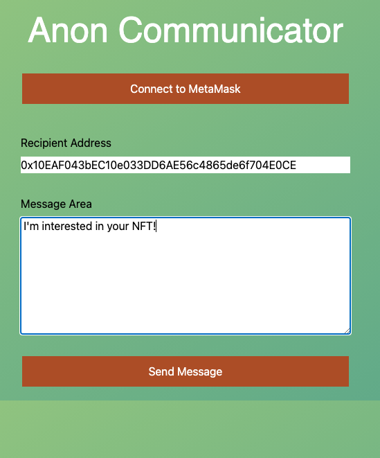

# MintMessage

The following repository is for Anon Communicator application which mints annonymous messages that can then be sent between NFT owner and interested party to start a correspondence or show interest in the NTF.  



# Anon Communicator: new application 

This is a tool that helps mint and send annonymous messages to a NFT owner to start correspondence on the NFT. 
 
The current project is the inital design and development of the application to get a MVP that can be tested on the current market cycle.

---

## Technologies


*[web3.js](https://web3js.readthedocs.io/en/v1.7.1/) - For documentation

*[browser based solidity development and testing environment](https://remix.ethereum.org/) Remix IDE

*[Node js](https://nodejs.org/en/docs/) - For documentation


---

## Installation Guide

Before running the application first install the following dependencies.

```python
  npm install dotenv --save-dev
    
    
```
*[Install Ganache](https://www.trufflesuite.com/ganache) - Download and install the Latest Version of Ganache

---

## Usage
Run the following command from the file directory (i.e scripts.js, uriFetch.js)

python -m http.server


---


## Contributors

Aheesh Nagraj -- https://github.com/Aheesh

Owen Wardlaw -- https://github.com/owardlaw

Stephen Miyumo -- https://github.com/odhissm

Israel Fernandez -- https://github.com/codan81

Noah Beito -- https://github.com/noahbeito


---

## License

MIT  

Copyright (c) 2022

Permission is hereby granted, free of charge, to any person obtaining a copy of this software and associated documentation files (the "Software"), to deal in the Software without restriction, including without limitation the rights to use, copy, modify, merge, publish, distribute, sublicense, and/or sell copies of the Software, and to permit persons to whom the Software is furnished to do so, subject to the following conditions:

The above copyright notice and this permission notice shall be included in all copies or substantial portions of the Software.

THE SOFTWARE IS PROVIDED "AS IS", WITHOUT WARRANTY OF ANY KIND, EXPRESS OR IMPLIED, INCLUDING BUT NOT LIMITED TO THE WARRANTIES OF MERCHANTABILITY, FITNESS FOR A PARTICULAR PURPOSE AND NONINFRINGEMENT. IN NO EVENT SHALL THE AUTHORS OR COPYRIGHT HOLDERS BE LIABLE FOR ANY CLAIM, DAMAGES OR OTHER LIABILITY, WHETHER IN AN ACTION OF CONTRACT, TORT OR OTHERWISE, ARISING FROM, OUT OF OR IN CONNECTION WITH THE SOFTWARE OR THE USE OR OTHER DEALINGS IN THE SOFTWARE.
